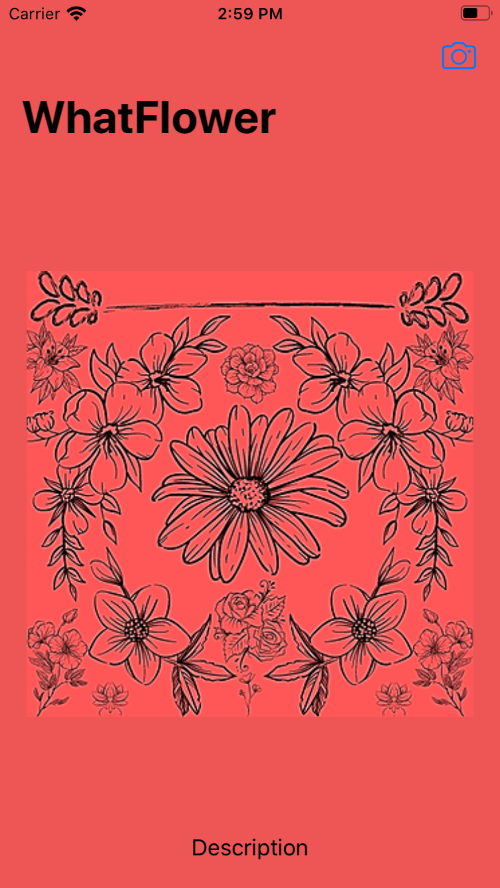
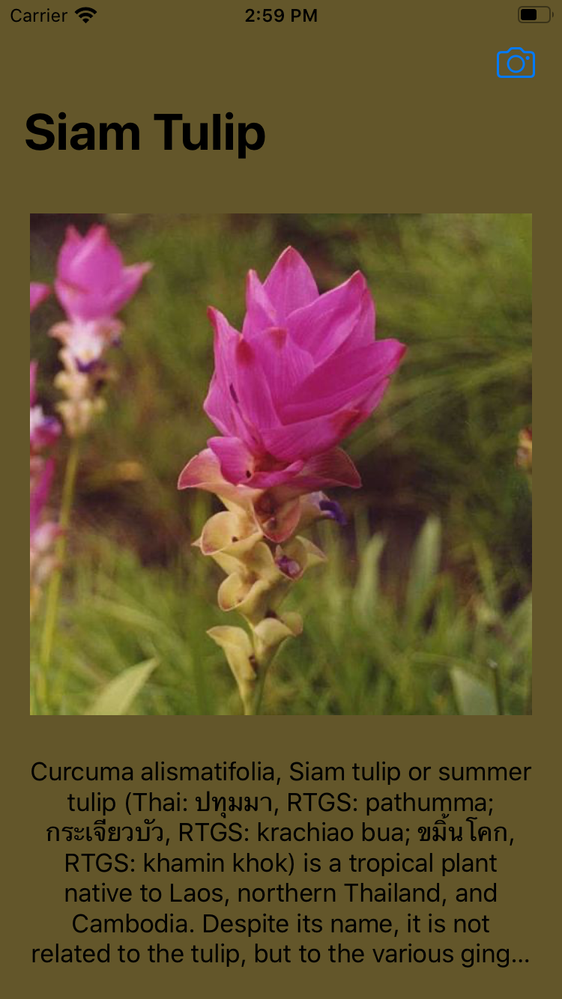

#  WhatFlower
An iOS Application which identifies the image of a flower using a FlowerClassifier Model.

 This application is part of <a href="https://www.udemy.com/course/ios-13-app-development-bootcamp/">iOS Application Bootcamp</a> course by Dr. Angela Yu, <a href="https://www.appbrewery.co">TheAppBrewery</a>.

## Screenshots
  

## Technologies
- <a href="http://developer.apple.com/documentation/swift"> Swift Programming Language </a>
- Storyboard
- <a href="https://developer.apple.com/documentation/uikit"> UIKit </a> 
    - <a href="https://developer.apple.com/documentation/uikit/uinavigationcontroller">  UINavigationController </a> | <a href="https://developer.apple.com/documentation/uikit/uinavigationcontrollerdelegate"> UINavigationControllerDelegate </a> | <a href="https://developer.apple.com/documentation/uikit/uibarbuttonitem"> UIBarButtonItem </a>
    - <a href="https://developer.apple.com/documentation/uikit/uiimageview"> UIImageView </a> | <a href=""> UILabel </a>
    - <a href="https://developer.apple.com/documentation/uikit/uiimagepickercontroller"> UIImagePickerController </a> | <a href="https://developer.apple.com/documentation/uikit/uiimagepickercontrollerdelegate"> UIImagePickerControllerDelegate </a>
- <a href=""> CaffeModel </a> | <a href="https://drive.google.com/uc?export=download&id=13v58uJqi_pAXKoBa2J7mZ7sLkaSRVUBb"> Download Flower Classifier </a>
- <a href=""> CoreMLTools </a> 
- <a href="https://developer.apple.com/documentation/coreimage"> Core Image </a> 
    - <a href="https://developer.apple.com/documentation/coreimage/ciimage"> CIImage </a>

- <a href="https://developer.apple.com/documentation/vision"> Vision </a>
    - <a href="https://developer.apple.com/documentation/vision/vncoremlmodel"> VNCoreMLModel </a>
    - <a href="https://developer.apple.com/documentation/vision/vncoremlrequest"> VNCoreMLRequest </a>
    - <a href="https://developer.apple.com/documentation/vision/vnclassificationobservation"> VNClassificationObservation </a>
    - <a href="https://developer.apple.com/documentation/vision/vnimagerequesthandler"> VNImageRequestHandler </a>
- <a href="https://developer.apple.com/documentation/dispatch/dispatchqueue"> DispatchQueue </a> | <a href="https://developer.apple.com/documentation/dispatch/dispatchqueue/1781006-main"> main </a>

## Things to do before Building Project
- Download Flower Classifier. 
    - Movie it to project directory: WhatFlower/WhatFlower
    - Directory name should be same i.e. "Flower Classifier"
- Execute Python Script "convert-script.py" from terminal as: python3 convert-script.py 
- FlowerClassifier MLModel would be created at project directory, drag and drop it to Xcode to attach references.
